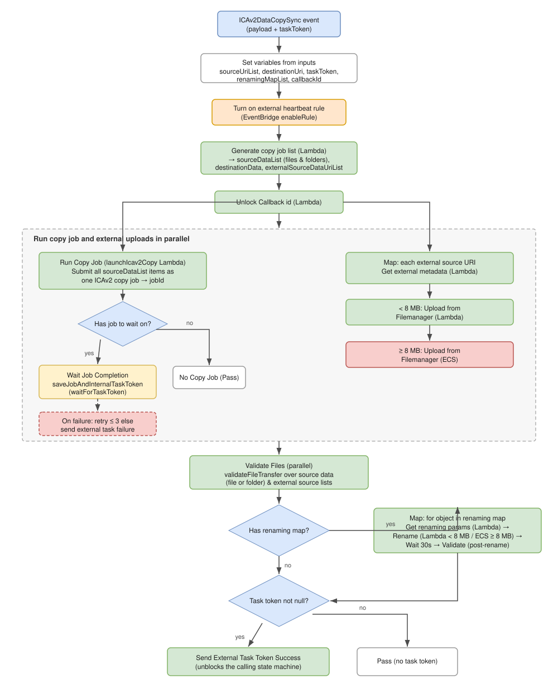
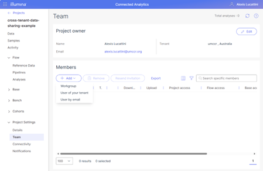
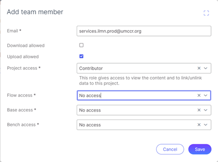
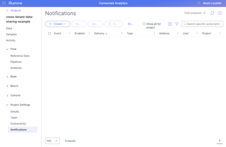
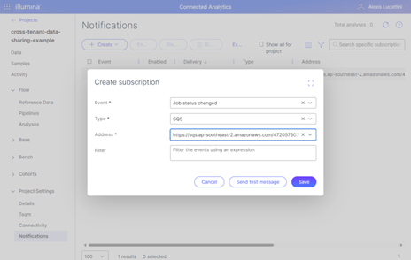

# ICAv2 Data Copy Manager

- [Overview](#overview)
  - [Upstream Services](#upstream-services)
  - [Downstream Services](#downstream-services)
- [Synchronous Integration](#synchronous-integration)
  - [How a caller integrates](#how-a-caller-integrates)
  - [How a request is copied](#how-a-request-is-copied)
  - [Heartbeat monitoring](#heartbeat-monitoring)
- [Event Contract](#event-contract)
  - [Consumed Events](#consumed-events)
  - [Event Payload](#event-payload)
  - [Submitting an Event](#submitting-an-event)
- [Step Functions](#step-functions)
  - [Handle Copy Jobs](#handle-copy-jobs)
  - [Supporting State Machines](#supporting-state-machines)
- [Infrastructure](#infrastructure)
  - [Stateful Resources](#stateful-resources)
  - [Stateless Resources](#stateless-resources)
  - [Stacks](#stacks)
- [CI/CD and Release Management](#cicd-and-release-management)
- [Project Notification Setup](#project-notification-setup)
- [Development](#development)
- [Related Services](#related-services)
- [Glossary & References](#glossary--references)

---

## Overview

This service is a centralised, event-driven, serverless orchestrator that copies data **within** or **between** different ICAv2 projects or tenants. It exists so that other OrcaBus microservices do not each need to reimplement the mechanics of an ICAv2 copy: submitting the copy job, tracking it to completion, copying data in from the filemanager, renaming files, and validating the transfer.

A caller sends a single `ICAv2DataCopySync` event to the `OrcaBusMain` EventBridge bus. The service then does the work — copying every file and folder listed in `sourceUriList` to the destination — and reports success or failure back to the caller. Because callers integrate through the Step Functions **task-token** callback pattern, the copy behaves synchronously from the caller's point of view: their state machine pauses until the copy finishes.

Every source (files and folders alike) is submitted together as a **single ICAv2 copy job**. The service acts on exactly the source URIs it is given — it does not walk the tree recursively, so the caller owns the set of source URIs it provides.

### Upstream Services

Any service can publish an `ICAv2DataCopySync` event. Confirmed callers today:

- [BSSH to AWS S3 Copy Manager](https://github.com/OrcaBus/service-bssh-to-aws-s3-copy-manager) — copies InterOp, Samples and Reports out of the BCL directory.
- [Data Sharing Manager](https://github.com/OrcaBus/service-data-sharing-manager) — stages data for sharing.
- CTTSOv2 / DRAGEN TSO500 ctDNA pipeline manager — stages pipeline inputs and outputs.

### Downstream Services

- [Filemanager](https://github.com/OrcaBus/service-filemanager) — the source of truth for `externalSourceUriList` uploads (data copied in from S3 via the filemanager rather than from another ICAv2 project).

---

## Synchronous Integration

Although the service is event-driven, it presents a **synchronous** contract to its callers by way of the Step Functions [task-token](https://docs.aws.amazon.com/step-functions/latest/dg/connect-to-resource.html#connect-wait-token) integration pattern.

### How a caller integrates

1. A caller's Step Function reaches a state that needs data copied. It uses the `.waitForTaskToken` service integration to **put** an `ICAv2DataCopySync` event onto `OrcaBusMain`, embedding `$$.Task.Token` as `Detail.taskToken`.
2. The caller's execution pauses on that state.
3. This service picks up the event, runs the `handleCopyJobs` state machine, and copies everything in `sourceUriList` (and any `externalSourceUriList`) to `destinationUri`.
4. On completion, the service calls `SendTaskSuccess` (or `SendTaskFailure`) against the caller's task token, which unblocks the caller's execution.

A DynamoDB table links AWS task tokens to ICAv2 copy job IDs so the service can match an asynchronous ICAv2 job-completion notification back to the right waiting execution.

### How a request is copied

`generateCopyJobList` resolves each entry in `sourceUriList` to an ICAv2 project data object. Files and folders both go into a single `sourceDataList`; any URI that cannot be resolved to an ICAv2 object (for example an `s3://` object) is collected into `externalSourceDataUriList`. `handleCopyJobs` then runs two branches in parallel:

- **Copy job** — all `sourceDataList` items are submitted together as one ICAv2 copy job. The branch waits on that job (via the `saveJobAndInternalTaskToken` state machine, task token) until ICAv2 signals completion, retrying up to 3 times before failing. If there was nothing to copy, the branch is a no-op.
- **External uploads** — each `externalSourceDataUriList` URI is copied in from the filemanager.

There is no per-folder splitting or single-part-file handling: because ICAv2 object tagging now behaves correctly, a folder can be copied directly as part of the single job.

### Heartbeat monitoring

To stop a caller from hanging indefinitely, callers may require a heartbeat on their task. While copy jobs are in flight, scheduled EventBridge rules trigger heartbeat state machines roughly every 3 minutes (inside a 5-minute heartbeat timeout) to send `SendTaskHeartbeat` for running jobs — covering external caller tokens, internal tokens, and queued jobs.

---

## Event Contract

### Consumed Events

| DetailType         | Source        | Event Bus     | Schema                                                                        | Description                                                                            |
| ------------------ | ------------- | ------------- | ----------------------------------------------------------------------------- | -------------------------------------------------------------------------------------- |
| `ICAv2DataCopySync` | _any_         | `OrcaBusMain` | [icav2-data-copy-sync.schema.json](app/event-schemas/icav2-data-copy-sync.schema.json) | Request to copy a list of source URIs to a destination URI. Carries a task token.       |
| ICAv2 Job Status Changed (`ICA_JOB_001`) | ICAv2 notifications (SQS) | Internal | — | ICAv2 copy job completion notifications, received via the `Icav2CopyJobSqsQueue` → `Icav2CopyJobEventPipe` EventBridge pipe. |

This service does not publish workflow events onto `OrcaBusMain`; it reports outcomes back to callers by resolving their task tokens. Its own event source identifier is `orcabus.icav2datacopymanager`.

### Event Payload

An `ICAv2DataCopySync` event carries a `payload` and a `taskToken`:

```json5
{
  "EventBusName": "OrcaBusMain",       // Centralised event bus
  "Source": "your.service",            // Any source; the service listens across all sources
  "DetailType": "ICAv2DataCopySync",   // Must be exactly this value
  "Detail": {
    "payload": {
      // Required: one or more source URIs to copy from
      "sourceUriList": [
        "icav2://project-id-or-name/path-to-data.txt",
        "icav2://project-id-or-name/path-to-folder/"
      ],
      // Required: destination to copy into
      "destinationUri": "icav2://project-id-or-name/path-to-destination/",
      // Optional: copy data in from the filemanager (s3:// or icav2:// sources)
      "externalSourceUriList": [
        "s3://bucket/path-to-object"
      ],
      // Optional: rename files after they land at the destination
      "renamingMapList": [
        { "sourceUri": "icav2://project/path/file.txt", "outputFileName": "renamed.txt" }
      ]
    },
    // AWS Step Functions task token used to signal completion back to the caller
    "taskToken": "your-task-token"
  }
}
```

Validate a payload against the [JSON Schema Validator](https://www.jsonschemavalidator.net/s/14XzDnBn) tool, or refer to the [schema file](app/event-schemas/icav2-data-copy-sync.schema.json).

### Submitting an Event

An example event is provided at [`examples/external-event.json`](examples/external-event.json). Submit it with:

```sh
export AWS_PROFILE='umccr-development'

aws events put-events \
  --no-cli-pager \
  --cli-input-json "$( \
    jq --raw-output \
      '{ "Entries": [ (.Detail = (.Detail | tojson)) ] }' \
      < "examples/external-event.json" \
  )"
```

---

## Step Functions

### Handle Copy Jobs

`handleCopyJobs` is the main (STANDARD) state machine. It is triggered when an `ICAv2DataCopySync` event lands on `OrcaBusMain`.



The flow:

1. **Set variables / turn on heartbeat** — captures the payload and enables the external heartbeat rule.
2. **Generate copy job list** — resolves each source URI, producing `sourceDataList` (files and folders) and `externalSourceDataUriList` (URIs that don't resolve to an ICAv2 object).
3. **Unlock callback id** — clears any callback lock so the job can proceed.
4. **Run copy job and external uploads in parallel** — two branches run concurrently:
   - **Copy job** — all `sourceDataList` items are submitted together as a single ICAv2 copy job. If a job was created, the branch waits on the `saveJobAndInternalTaskToken` state machine (task token) until ICAv2 signals completion, retrying up to 3 times before failing; if there was nothing to copy, it is a no-op.
   - **External sources** — each external URI is copied in from the filemanager (a Lambda under 8 MB, an ECS Fargate task at or above 8 MB).
5. **Validate files** — confirms every source (files, folders, and external URIs) landed at the destination.
6. **Optional rename** — if a `renamingMapList` was supplied, each object is renamed (Lambda or ECS by size), followed by a short wait and a post-rename validation.
7. **Signal the caller** — if a task token is present, `SendTaskSuccess` unblocks the caller; otherwise the execution simply completes.

The editable diagram source is at [`docs/drawio-exports/handle-copy-jobs.drawio.xml`](docs/drawio-exports/handle-copy-jobs.drawio.xml).

### Supporting State Machines

| State machine                | Type     | Role                                                                                                   |
| ---------------------------- | -------- | ------------------------------------------------------------------------------------------------------ |
| `saveJobAndInternalTaskToken` | Express  | Called by "Wait Job Completion"; stores the task token + ICAv2 copy job ID in DynamoDB. ([diagram](docs/sfn-workflow-studio-exports/save_job_and_internal_task_token_sfn_diagram.svg)) |
| `sendInternalTaskToken`       | Express  | Triggered by ICAv2 job-completion notifications; looks up the token and resolves the waiting execution (success or failure). ([diagram](docs/sfn-workflow-studio-exports/send_internal_task_token_sfn_diagram.svg)) |
| `sendCopyJobsToQueue`         | Express  | Enqueues copy jobs onto the internal queue for throttled dispatch.                                     |
| `sendHeartbeatExternal`       | Standard | Sends heartbeats for external (caller) task tokens.                                                     |
| `sendHeartbeatInternal`       | Standard | Sends heartbeats for internal task tokens. ([diagram](docs/sfn-workflow-studio-exports/send_heartbeats_sfn_diagram.svg)) |
| `sendHeartbeatOfQueueJobs`    | Standard | Sends heartbeats for jobs still buffered on the internal queue.                                         |

The event bus and targets overview is captured at [`docs/drawio-exports/icav2-data-copy-manager.drawio.svg`](docs/drawio-exports/icav2-data-copy-manager.drawio.svg).

---

## Infrastructure

The service deploys with AWS CDK and is split into a **stateful** stack (persistent state) and a **stateless** stack (replaceable compute and routing). SSM parameters live under `/orcabus/services/icav2-data-copy/`.

- Event bus: `OrcaBusMain`
- Consumed detail type: `ICAv2DataCopySync`
- Service event source: `orcabus.icav2datacopymanager`

### Stateful Resources

- **DynamoDB table** `icav2DataCopyManagerDynamoDBTable` — links AWS task tokens to ICAv2 copy job IDs. The table is transient (`RemovalPolicy.DESTROY`).
- **ICA notification queue** `Icav2CopyJobSqsQueue` — receives ICAv2 "Job Status Changed" notifications, fronted by the `Icav2CopyJobEventPipe` EventBridge pipe. Cross-account send is granted to the ICA AWS account (`079623148045`).
- **Internal copy-job queue** `InternalIcav2CopyJobSqsQueue` — buffers copy jobs (15-minute visibility timeout, long-poll receive).
- **Dead-letter queues + CloudWatch alarms** — DLQ depth breaching the threshold raises an alarm to the `AwsChatBotTopic` Slack topic.
- **EventBridge Schemas registry** entry for `icav2DataCopySync`.

### Stateless Resources

- **Lambda functions** (Python 3.14, ARM64) — one per task in the state machines. See [`app/lambdas/`](app/lambdas/): `checkJobStatus`, `generateCopyJobList`, `getExternalSourceFileMetadata`, `getRenamingMapParams`, `launchIcav2Copy`, `renameFile`, `throttleCopyJobs`, `unlockCallbackId`, `uploadFromFilemanager`, `validateFileTransfer`.
- **ECS Fargate tasks** (2 vCPU, 16 GB) — used for external filemanager uploads and renames of files at or above 8 MB. See [`app/ecs/`](app/ecs/): `renameFile`, `uploadFromFilemanager`.
- **Step Functions** — the seven state machines described above, from [`app/step-function-templates/`](app/step-function-templates/).
- **EventBridge rules / targets / pipes** — route the incoming `ICAv2DataCopySync` event and ICAv2 notifications, plus three scheduled heartbeat rules (`externalHeartBeatScheduleRule`, `internalHeartBeatScheduleRule`, `sqsQueueScheduleRule`).
- **Secrets** — the ICAv2 JWT (`ICAv2JWTKey-umccr-prod-service-*`) and the OrcaBus token, read from Secrets Manager.

### Stacks

The CDK project deploys a CodePipeline in the toolchain account that promotes changes to `beta`, `gamma`, and `prod`.

```sh
# List stateful stacks
pnpm cdk-stateful list
# OrcaBusStatefulServiceStack
# OrcaBusStatefulServiceStack/.../OrcaBusBeta/Icav2DataCopyManagerStatefulDeployStack
# OrcaBusStatefulServiceStack/.../OrcaBusGamma/Icav2DataCopyManagerStatefulDeployStack
# OrcaBusStatefulServiceStack/.../OrcaBusProd/Icav2DataCopyManagerStatefulDeployStack

# List stateless stacks
pnpm cdk-stateless list
# OrcaBusStatelessServiceStack
# OrcaBusStatelessServiceStack/.../OrcaBusBeta/Icav2DataCopyManagerStatelessDeployStack
# OrcaBusStatelessServiceStack/.../OrcaBusGamma/Icav2DataCopyManagerStatelessDeployStack
# OrcaBusStatelessServiceStack/.../OrcaBusProd/Icav2DataCopyManagerStatelessDeployStack
```

Deploy mode is selected by CDK context (`-c deployMode=stateless` or `-c deployMode=stateful`), dispatched from [`bin/deploy.ts`](bin/deploy.ts).

---

## CI/CD and Release Management

Pull requests run two GitHub Actions jobs (see [`.github/workflows/pr-tests.yml`](.github/workflows/pr-tests.yml)); both skip draft PRs and ignore-only changes to `.md`, `.svg`, `.drawio`, and `.png` files:

1. **pre-commit-lint-security** — TruffleHog secret scanning plus `make check` (audit, prettier, eslint, pre-commit hooks).
2. **test-iac** — `pnpm test`, which type-checks and runs the CDK nag compliance tests in [`test/`](test/).

Changes merged to `main` are picked up by the toolchain CodePipelines (`OrcaBus-Icav2DataCopyManagerStatefulPipeline` and `OrcaBus-Icav2DataCopyManagerStatelessPipeline`) and promoted through `beta` → `gamma` → `prod`. Validate locally with `cdk synth` and `pnpm test` before pushing.

---

## Project Notification Setup

For this service to operate on an ICAv2 (or BSSH-managed ICAv2) project, complete the following once per project. Both steps can also be done after project creation.

### Add the service user to the project team

To let the UMCCR team write data into the project, add the production service user. If the user is not in your tenant, add them with the "User by email" option. The service user needs:

- Upload allowed
- **Contributor** access at the project level (Viewer is insufficient — it blocks folder creation via the ICA API)





### Add the notifications channel

So the orchestration engine knows when data has transferred, create a subscription in the notifications channel for **Job Status Changed** (event code `ICA_JOB_001`) targeting this SQS address:

```
https://sqs.ap-southeast-2.amazonaws.com/472057503814/Icav2CopyJobSqsQueue
```

- `472057503814` is the UMCCR AWS production account ID.
- `Icav2CopyJobSqsQueue` is the queue name defined in the application constants.





---

## Development

Requires Node `v22.9.0`+ with Corepack-managed `pnpm`.

```sh
# Enable pnpm via Corepack
npm install --global corepack@latest
corepack enable pnpm

# Install dependencies (frozen lockfile)
make install

# Lint, format and pre-commit checks
make check
make fix        # auto-fix prettier + eslint

# Type-check and run the CDK nag tests
make test

# CDK entry points
pnpm cdk-stateless <command>
pnpm cdk-stateful  <command>
```

Project layout:

- [`app/`](app/) — Lambda functions, ECS tasks, Step Function templates, and event schemas.
- [`infrastructure/stage/`](infrastructure/stage/) — application CDK stacks and per-concern construct modules (`lambda/`, `ecs/`, `step-functions/`, `event-rules/`, `event-targets/`, `sqs/`, `dynamodb/`, `event-bus/`, `event-schemas/`). Config, constants, and interfaces live at the module root.
- [`infrastructure/toolchain/`](infrastructure/toolchain/) — CodePipeline deployment stacks.
- [`bin/deploy.ts`](bin/deploy.ts) — CDK app entry point.
- [`test/`](test/) — CDK nag compliance tests.

---

## Related Services

| Role                | Service                                                                                       |
| ------------------- | --------------------------------------------------------------------------------------------- |
| Upstream (caller)   | [BSSH to AWS S3 Copy Manager](https://github.com/OrcaBus/service-bssh-to-aws-s3-copy-manager) |
| Upstream (caller)   | [Data Sharing Manager](https://github.com/OrcaBus/service-data-sharing-manager)               |
| Upstream (caller)   | CTTSOv2 / DRAGEN TSO500 ctDNA pipeline manager                                                |
| Downstream (source) | [Filemanager](https://github.com/OrcaBus/service-filemanager)                                 |

---

## Glossary & References

- Task-token integration: [AWS Step Functions — Wait for a Callback with the Task Token](https://docs.aws.amazon.com/step-functions/latest/dg/connect-to-resource.html#connect-wait-token)
- Platform glossary: [OrcaBus wiki](https://github.com/OrcaBus/wiki/blob/main/orcabus-platform/README.md#glossary--references)
- For development conventions, build commands, and project structure see the [steering docs](.kiro/steering/).
