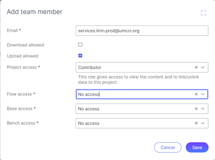

# Service ICAv2 Data Copy Manager

## Overview

Centralised event-based serverless orchestration method to copy data within or between different ICAv2 projects / tenants.

This service will allow step functions from other services to send a copy request to the event bus as a task,
and then 'hang' on that task until the copy job is completed.

## Application Overview

The application is designed to listen to job request events on a centralised event bus.

An event object will contain the following information:

```json5
{
  "EventBusName": "OrcaBusMain",  // Name of centralised event bus
  "Source": "Whatever",  // Source of the event is not relevant as we listen to events from all sources
  "DetailType": "ICAv2DataCopySync",  // Type of event we are interested in, in this case this should be 'ICAv2DataCopySync'
  "Detail": { // Requires two keys, "payload" and "taskToken"
    "payload": {
      // Requires sourceUriList, which is a list of uris to copy from,
      // And a destinationUri, which is the uri to copy to
      "sourceUriList": [
        "icav2://project-id-or-name/path-to-data.txt",
        "icav2://project-id-or-name/path-to-folder/"
      ],
      "destinationUri": "icav2://project-id-or-name/path-to-destination/"
    },
    // The task token is specific to AWS Step Functions and is used to track the progress of the task.
    "taskToken": "your-task-token"
  }
}
```

You can view the event schema under [event-schemas/icav2-data-copy-sync.json](event-schemas/icav2-data-copy-sync.json).
and validate your event with the [JSON Schema Validator](https://www.jsonschemavalidator.net/s/14XzDnBn) tool.


This service will recursively copy all files and folders from the source to the destination.
For each subfolder, it will generate its own copy event and send it to the event bus, which is picked up by itself.

This allows for a single event to be sent to the service, and it will handle the rest.

Be very careful with this, recursive events should be used with caution, as they can cause infinite loops if not handled properly.

This service uses a DynamoDb table to link AWS Task Tokens to ICAv2 Copy Job IDs.


## Applied Use-Cases

> Links are unapplicable as they're currently within our Orcabus Monolith Repository

- bssh-to-aws-s3-copy service :construction:
- data-sharing-service :construction:
- cttsov2-workflow-manager :construction:


## Example External Event

An example event can be found under the `examples/external-event.json`

You can manually launch this event with the following command:

```sh
export AWS_PROFILE='umccr-development'

aws events put-events \
  --no-cli-pager \
  --cli-input-json "$( \
    jq --raw-output \
      '
        {
          "Entries": [
            (.Detail = (.Detail | tojson))
          ]
        }
      ' < "external-event.json" \
)"
```


## Event Bus / Events Targets Overview


## Step Functions Diagrams

### Copy Job Handler

After an event is sent to the OrcaBusMain event bus, this will trigger the step function shown below.

Any single-part files are handled separately, multi-part files are submitted collectively as an ICAv2 Copy Job.

The "Wait Job Completion" stage then triggers the 'save-internal-task-token' step function (see below).
The state machine execution hangs at the 'Wait Job Completion' task until it is 'released' by the 'send-internal-task-token' step function (see below).

If there are any subfolders in the sourceUriList, the service will send a new event to the event bus for each subfolder, that will in-turn trigger this step function.


### Save Internal Task Token

This step function is called by the 'Wait Job Completion' task in the 'handle-copy-job' step function.

This will save the task token along with the ICAv2 Copy Job ID into the DynamoDb table.


### Send Internal Task Token

This step function will listen to ICAv2 Copy Job events.

When a copy job is completed, it will trigger this step function, which will look up the task token in the DynamoDb table and send it to the 'send-internal-task-token' step function.

This will send the task token to the copy job handler, unlocking the step function execution from the 'Wait Job Completion' task.

If the copy job has failed for any reason, the task token will be sent to the 'send-internal-task-token' step function with a failure message.


### HeartBeat Monitor

To stop services from hanging indefinitely, a heartbeat monitor is used to check the status of the step function execution.

The service can place a heartbeat requirement on their put event, which expects the service to send a heartbeat event to the event bus every 5 minutes.

If there are any running jobs in the database, the service will check the status of the job every 5 minutes and send through a heartbeat event to the event bus.


## Infrastructure Dependencies

> See also: [Project Notification Section Setup](#project-notification-setup) Below


### Event Bus

An existing event bus for other microservices to publish events to. This event bus is used to trigger the data copy process.

This stack also builds its own Event bus for internal events.

### Token

An available and existing ICAv2 JWT token (with rotation enabled) in AWS secrets manager with access to the source and target ICAv2 projects.


## Project Directory Structure

The project is organized into the following key directories:

- **`./app`**: Contains the main application logic and blue-prints.

- **`./bin/deploy.ts`**: Serves as the entry point of the application. It initializes two root stacks: `stateless` and `stateful`.

- **`./infrastructure`**: Contains the infrastructure code for the project:
  - **`./infrastructure/toolchain`**: Includes stacks for the stateless and stateful resources deployed in the toolchain account. These stacks primarily set up the CodePipeline for cross-environment deployments.
  - **`./infrastructure/stage`**: Defines the stage stacks for different environments:
    - **`./infrastructure/stage/constants.ts`**: Contains constants used in the application, these can be both application globals, and organisation specific constants.
    - **`./infrastructure/stage/config.ts`**: Contains environment-specific configurations, (e.g., `beta`, `gamma`, `prod`).
    - **`./infrastructure/stage/interfaces.ts`**: These define the functional interfaces for the application, used in the application stacks.
    - **`./infrastructure/stage/stateful-application-stack.ts`**: The CDK stack entry point for provisioning resources required by the application in `./app`.
    - **`./infrastructure/stage/stateless-application-stack.ts`**: The CDK stack entry point for provisioning resources required by the application in `./app`.

- **`.github/workflows/pr-tests.yml`**: Configures GitHub Actions to run tests for `make check` (linting and code style), tests defined in `./test`, and `make test` for the `./app` directory. Modify this file as needed to ensure the tests are properly configured for your environment.

- **`./test`**: Contains tests for CDK code compliance against `cdk-nag`. You should modify these test files to match the resources defined in the `./infrastructure` folder.

## Setup

### Requirements

```sh
node --version
v22.9.0

# Update Corepack (if necessary, as per pnpm documentation)
npm install --global corepack@latest

# Enable Corepack to use pnpm
corepack enable pnpm

```

### Install Dependencies

To install all required dependencies, run:

```sh
make install
```

### CDK Commands

You can access CDK commands using the `pnpm` wrapper script.

This template provides two types of CDK entry points: `cdk-stateless` and `cdk-stateful`.

- **`cdk-stateless`**: Used to deploy stacks containing stateless resources (e.g., AWS Lambda), which can be easily redeployed without side effects.
- **`cdk-stateful`**: Used to deploy stacks containing stateful resources (e.g., AWS DynamoDB, AWS RDS), where redeployment may not be ideal due to potential side effects.

The type of stack to deploy is determined by the context set in the `./bin/deploy.ts` file. This ensures the correct stack is executed based on the provided context.

For example:

```sh
# Deploy a stateless stack
pnpm cdk-stateless <command>

# Deploy a stateful stack
pnpm cdk-stateful <command>
```

## CDK Stacks

#### Stateful Stacks

This CDK project manages multiple stacks. The root stack (the only one that does not include `DeploymentPipeline` in its stack ID) is deployed in the toolchain account and sets up a CodePipeline for cross-environment deployments to `beta`, `gamma`, and `prod`.

To list all available stacks, run:

```sh
pnpm cdk-stateful list
```

```
OrcaBusStatefulServiceStack
OrcaBusStatefulServiceStack/Icav2DataCopyManagerStatefulDeploymentPipeline/OrcaBusBeta/Icav2DataCopyManagerStatefulDeployStack (OrcaBusBeta-Icav2DataCopyManagerStatefulDeployStack)
OrcaBusStatefulServiceStack/Icav2DataCopyManagerStatefulDeploymentPipeline/OrcaBusGamma/Icav2DataCopyManagerStatefulDeployStack (OrcaBusGamma-Icav2DataCopyManagerStatefulDeployStack)
OrcaBusStatefulServiceStack/Icav2DataCopyManagerStatefulDeploymentPipeline/OrcaBusProd/Icav2DataCopyManagerStatefulDeployStack (OrcaBusProd-Icav2DataCopyManagerStatefulDeployStack)
```

#### Stateless Stacks

This CDK project manages multiple stacks. The root stack (the only one that does not include `DeploymentPipeline` in its stack ID) is deployed in the toolchain account and sets up a CodePipeline for cross-environment deployments to `beta`, `gamma`, and `prod`.

To list all available stacks, run:

```sh
pnpm cdk-stateless list
```

Example output:

```sh
OrcaBusStatelessServiceStack
OrcaBusStatelessServiceStack/Icav2DataCopyManagerStatelessDeploymentPipeline/OrcaBusBeta/Icav2DataCopyManagerStatelessDeployStack (OrcaBusBeta-Icav2DataCopyManagerStatelessDeployStack)
OrcaBusStatelessServiceStack/Icav2DataCopyManagerStatelessDeploymentPipeline/OrcaBusGamma/Icav2DataCopyManagerStatelessDeployStack (OrcaBusGamma-Icav2DataCopyManagerStatelessDeployStack)
OrcaBusStatelessServiceStack/Icav2DataCopyManagerStatelessDeploymentPipeline/OrcaBusProd/Icav2DataCopyManagerStatelessDeployStack (OrcaBusProd-Icav2DataCopyManagerStatelessDeployStack)
```

## Linting and Formatting

### Run Checks

To run linting and formatting checks on the root project, use:

```sh
make check
```

### Fix Issues

To automatically fix issues with ESLint and Prettier, run:

```sh
make fix
```


## Project Notification Setup

In order to for this service to work on an ICAv2 or BSSH Managed ICAv2 Project,
one must perform the following steps when setting up the project.

This can all also be done after the project has been created.

### Adding the service user to the project team

In order for the UMCCR team to write data to this ICAv2 project,
one will need to add our production service user to the project.

If the user is not in your tenant, they will need to be added by the ‘User by email’ option.

The service user will need the following permissions:
•	Upload allowed
•	Contributor access to the Project level
  * I have tried with Viewer and this is unsuccessful
    as it does not allow folder creation via the ICA API)




### Adding the notifications channel

In order for our event-based orchestration engine to know
that all data has been successfully transferred, we require the following notification setup.

In the notifications channel,
create a new subscription for ‘Job Status Changed’ (Event code ICA_JOB_001),
with the following SQS address: https://sqs.ap-southeast-2.amazonaws.com/472057503814/IcaEventPipeStackQueue
  * (472057503814 is our AWS Production Account ID)
  * Icav2CopyJobEventPipe is the name of the SQS queue defined in the application constants


